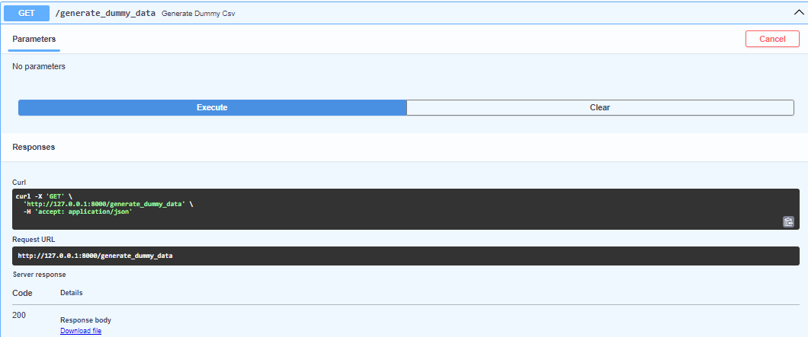
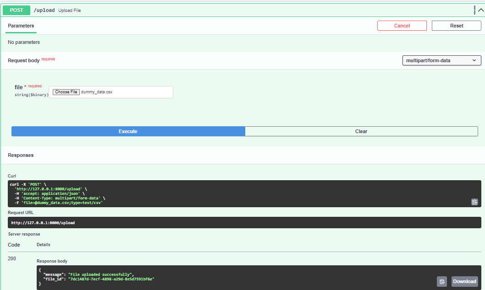
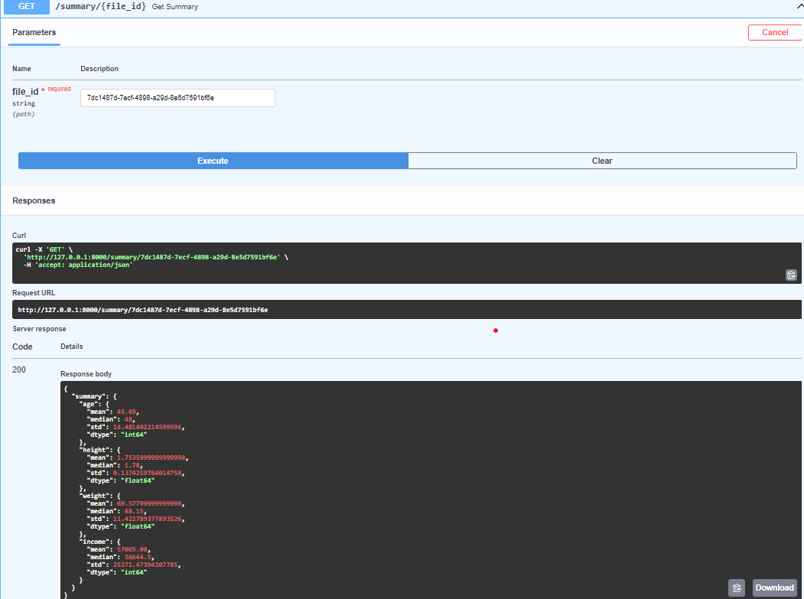
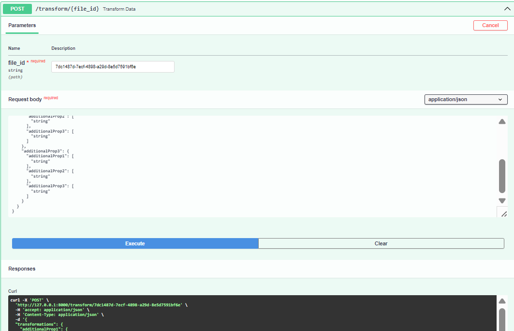
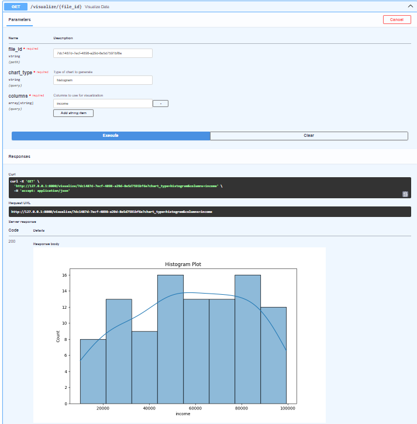

# FastAPI Data Analysis Project

Welcome to the FastAPI Data Analysis project! This powerful tool allows you to upload CSV files, perform data transformations, generate visualizations, and even create dummy data for testing. Let's dive in and explore what this project can do for you!

## 🚀 Features

- 📤 File upload and storage
- 📊 Data summary generation
- 🔄 Data transformations
- 📈 Data visualization
- 🧪 Dummy data generation

## 🛠️ Technology Stack

- **FastAPI**: A modern, fast (high-performance) web framework for building APIs with Python 3.6+ based on standard Python type hints.
- **Pandas**: For data manipulation and analysis.
- **Matplotlib & Seaborn**: For creating static, animated, and interactive visualizations.
- **Pytest**: For running our test suite.

## 🏃‍♂️ How to Run the Project

1. Clone the repository to your local machine.
2. Navigate to the project directory.
3. Install the required packages: pip install -r requirements.txt
4. Run the FastAPI server: uvicorn main:app --reload
5. Open your browser and go to `http://127.0.0.1:8000/docs` to see the Swagger UI documentation.

## 🧬 Object-Oriented Programming (OOP) Concepts

This project leverages several key OOP concepts to create a modular, maintainable, and extensible codebase:

1. **Encapsulation**: 
   - The `DataHandler` class encapsulates all the data processing logic, keeping the data (DataFrame) and its operations bundled together.
   - The `Visualizer` class encapsulates the visualization creation process, separating it from the rest of the application logic.

2. **Abstraction**:
   - The `DataHandler` class provides a high-level interface for data operations (like `get_summary()` and `apply_transformations()`), hiding the complex implementation details from the user.
   - The `Visualizer` class abstracts away the details of creating visualizations, providing a simple `create_visualization()` method.

3. **Single Responsibility Principle**:
   - Each class has a single, well-defined responsibility. For example, `DataHandler` is responsible for data processing, while `Visualizer` is responsible for creating visualizations.

4. **Open/Closed Principle**:
   - The design allows for easy extension. For example, new transformation types can be added to the `DataHandler` without modifying existing code.
   - New chart types can be added to the `Visualizer` by extending the `create_visualization()` method.

These OOP concepts contribute to a robust and flexible architecture, making the code easier to understand, maintain, and extend as the project grows.

## 🎯 How to Use Each API Endpoint

### 1. Generate Dummy Data
- **Endpoint**: GET `/generate_dummy_data`
- **How to use**: 
1. Click on the endpoint in the Swagger UI.
2. Click "Try it out" and then "Execute".
3. A CSV file with dummy data will be downloaded.



### 2. Upload a File
- **Endpoint**: POST `/upload`
- **How to use**:
1. Click on the endpoint in the Swagger UI.
2. Click "Try it out".
3. Choose a CSV file to upload.
4. Click "Execute".
5. You'll receive a `file_id`. Save this for later use!



### 3. Get Data Summary
- **Endpoint**: GET `/summary/{file_id}`
- **How to use**:
1. Click on the endpoint in the Swagger UI.
2. Click "Try it out".
3. Enter the `file_id` you received from the upload.
4. Click "Execute".
5. You'll see a summary of your data, including mean, median, and standard deviation for each column.



### 4. Transform Data
- **Endpoint**: POST `/transform/{file_id}`
- **How to use**:
1. Click on the endpoint in the Swagger UI.
2. Click "Try it out".
3. Enter the `file_id` you want to transform.
4. In the Request body, specify the transformations you want to apply. For example:
  ```json
  {
    "transformations": {
      "normalize": ["age", "income"]
    }
  }
  ```
  This will normalize the age and income columns.

5. Click "Execute".
You'll receive a new `file_id` for the transformed data.



### 5. Visualize Data
- **Endpoint**: GET `/visualize/{file_id}`
- **How to use**:
1. Click on the endpoint in the Swagger UI.
2. Click "Try it out".
3. Enter the `file_id` you want to visualize.
4. In the Request body, specify the chart type and columns you want to visualize. For example:
  ```json
  {
    "chart_type": "histogram",
    "columns": ["age"]
  }
  ```
  This will create a histogram of the age column.
5. Click "Execute".
6. You'll see a PNG image of the chart.



